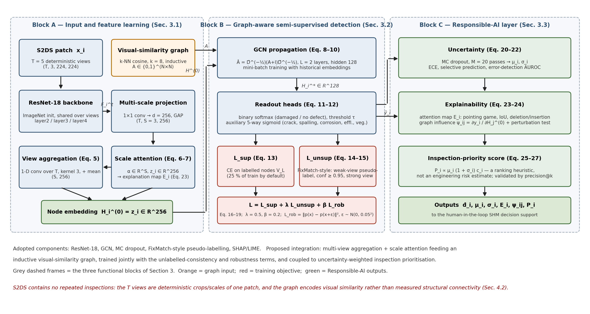
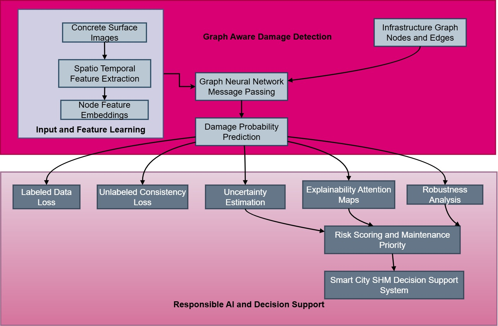
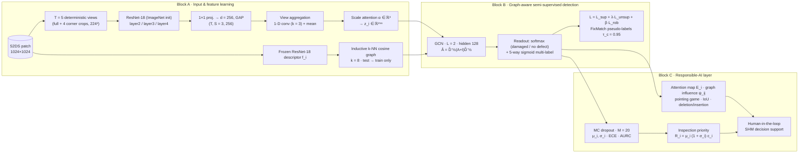
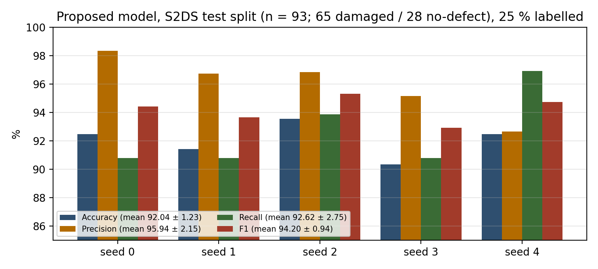
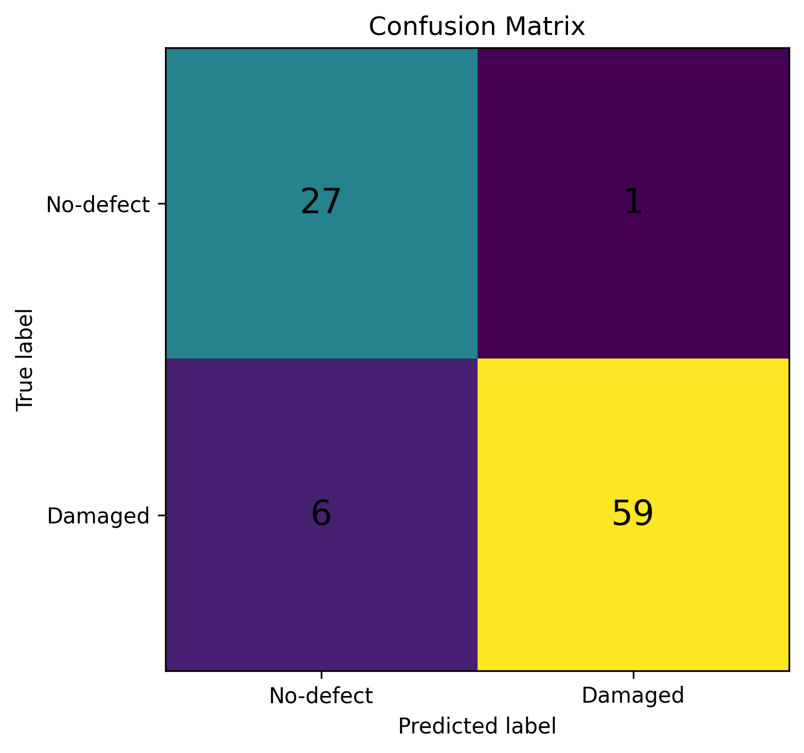

# Responsible Graph Neural Networks for Structural Damage Detection in Smart Cities

[](https://www.python.org/)
[](https://pytorch.org/)
[](LICENSE)
[](https://github.com/ben-z-original/s2ds)
[](.github/workflows/ci.yml)

Official code for the paper

> **K. Kiruthika and S. P. Sasirekha**, *Responsible Graph Neural Networks for Structural Damage Detection in Smart Cities*, Department of Computer Science and Engineering, Karpagam Academy of Higher Education, Coimbatore, India. Submitted to *Discover Computing* (2026).

The framework turns concrete-surface inspection patches into nodes of an **inductive visual-similarity graph**, encodes each node with **multi-view, multi-scale ResNet-18 features and hierarchical scale attention**, propagates evidence with a **graph convolutional network**, and trains with a **FixMatch-style semi-supervised objective** plus a **prediction-consistency robustness term**. A **Responsible-AI layer** adds Monte Carlo-dropout uncertainty with calibration and selective prediction, attention- and graph-level explanations with measured fidelity, and an uncertainty-weighted **inspection-priority score**. Everything is evaluated on the public **S2DS** benchmark with its original 563 / 87 / 93 split, five seeds, confidence intervals and paired tests.

---

## Contents

1. [Architecture](#architecture)
2. [Pipeline at a glance](#pipeline-at-a-glance)
3. [Results](#results)
4. [Installation](#installation)
5. [Data preparation](#data-preparation)
6. [Reproducing the experiments](#reproducing-the-experiments)
7. [Reproducing the tables from prediction records](#reproducing-the-tables-from-prediction-records)
8. [Repository layout](#repository-layout)
9. [Mapping between the paper and the code](#mapping-between-the-paper-and-the-code)
10. [Citation](#citation)
11. [References](#references)

---

## Architecture

<p align="center">
  
</p>

*Figure 2 of the paper. Block A — graph-structured input and feature learning (Sec. 3.1); Block B — graph-aware semi-supervised detection (Sec. 3.2); Block C — Responsible-AI layer (Sec. 3.3). Equation numbers refer to the manuscript.*

<p align="center">
  
</p>

*Figure 1 of the paper: functional overview of the Responsible-AI-enabled damage-detection pipeline.*

## Pipeline at a glance



## Results

Test split of S2DS (93 patches: 65 damaged / 28 no-defect), 25 % of the training patches labelled, five independent seeds (model initialisation, labelled-subset draw and augmentation stream re-seeded). Values below are reproduced bit-for-bit by `scripts/report_from_records.py` from the per-seed prediction records in `results/records/`.

| Metric (proposed model) | Mean ± s.d. (%) | 95 % CI |
|---|---|---|
| Accuracy | **92.04 ± 1.23** | [90.52, 93.57] |
| Precision | 95.94 ± 2.15 | [93.26, 98.61] |
| Recall | 92.62 ± 2.75 | [89.20, 96.03] |
| F1 (damaged class) | **94.20 ± 0.94** | [93.04, 95.37] |

| Seed | Accuracy | Precision | Recall | F1 | TP | FP | FN | TN |
|---|---|---|---|---|---|---|---|---|
| 0 | 92.47 | 98.33 | 90.77 | 94.40 | 59 | 1 | 6 | 27 |
| 1 | 91.40 | 96.72 | 90.77 | 93.65 | 59 | 2 | 6 | 26 |
| 2 | 93.55 | 96.83 | 93.85 | 95.31 | 61 | 2 | 4 | 26 |
| 3 | 90.32 | 95.16 | 90.77 | 92.91 | 59 | 3 | 6 | 25 |
| 4 | 92.47 | 92.65 | 96.92 | 94.74 | 63 | 5 | 2 | 23 |

<p align="center">
  
  <br>
  
</p>

*Left/top: per-seed test metrics. Bottom: confusion matrix of seed 0 (Figure 5 of the paper). Precision exceeds recall — the model rarely raises a false alarm on a sound patch but misses roughly one damaged patch in fourteen, which is why the paper couples the detector to uncertainty-based referral and allows the decision threshold τ to be lowered in deployment.*

Baselines (CNN, CNN + LSTM, GCN, GAT, supervised-only variant), ablations, annotation-budget curves, calibration / selective prediction, corruption robustness, explanation fidelity and priority-ranking quality (Tables 3–12 of the paper) are produced by `scripts/run_all.py` under the identical protocol; see [Reproducing the experiments](#reproducing-the-experiments).

## Installation

```bash
git clone https://github.com/<org>/responsible-gnn-shm.git
cd responsible-gnn-shm
python -m venv .venv && source .venv/bin/activate
pip install -r requirements.txt
pip install -e .
```

Tested with Python 3.10, PyTorch 2.1, torchvision 0.16 on an NVIDIA RTX 3080 (10 GB) under Ubuntu 20.04. `shap`, `lime` and `scikit-image` are only needed for `rgnn_shm/explain.py`.

## Data preparation

```bash
git clone https://github.com/ben-z-original/s2ds /data/s2ds   # S2DS, original 563/87/93 split
# point config.yaml -> data.root at the clone; adapt _find_mask() in rgnn_shm/data.py if the mask
# file-name convention of your copy differs from the candidates listed there.
python scripts/run_all.py --config config.yaml --out results --stage index
```

`--stage index` writes `results/index.csv` (the reproducible split identifier: every patch with its split, binary label, multi-label vector and per-class pixel fractions) and `results/dataset_stats.csv` (Table 1b). Patch-level labels are derived from the pixel masks: a defect class is present if it covers ≥ 0.1 % of the patch; the binary target is 1 if any of {crack, spalling, corrosion, efflorescence, vegetation} is present; control points are ignored.

## Reproducing the experiments

```bash
python scripts/run_all.py --stage all --out results        # ≈ 1 GPU-day on an RTX 3080
```

Stages can be run individually (`--stage tune | main | ablation | budget | views | hparam | corrupt`):

| Stage | What it does | Paper |
|---|---|---|
| `tune` | 20-trial random search per method on the **validation** split (same budget for every method) | Table 2 |
| `main` | CNN, CNN+LSTM, GCN, GAT, supervised-only and proposed; 5 seeds; mean ± s.d., 95 % CI, paired t-test over seeds, paired bootstrap over the 93 shared test patches | Tables 6, 9, 12 |
| `ablation` | removes graph propagation / multi-view aggregation / attention / unlabelled objective / robustness term, GCN→GAT, shuffled view order | Table 7 |
| `budget` | semi-supervised vs supervised-only at 10 / 25 / 50 / 100 % labels, 5 subset draws, pseudo-label acceptance rate | Table 8, Fig. 6 |
| `views` | T ∈ {1, 3, 5, 7} and shuffled-order control | Table 5 |
| `hparam` | λ and β sensitivity, clean vs corrupted accuracy | Tables 3–4 |
| `corrupt` | Gaussian noise σ ∈ {0.02, 0.05, 0.10}, blur, JPEG, brightness — identical perturbations for every method | Table 10 |

Explanation fidelity (pointing game, IoU, deletion/insertion, graph-influence perturbation test, SHAP–LIME agreement; Table 11):

```python
from rgnn_shm.explain import run_explainability, shap_lime_agreement
```

All outputs land in `results/tables.md` and `results/records/*.json`. Each record stores the per-node mean probability `_p`, the labels, confusion counts and bootstrap intervals, so every table can be re-derived without re-training.

## Reproducing the tables from prediction records

```bash
python scripts/report_from_records.py --records results/records --out results
```

reads `seed_<k>.json` files (`y_true`, `y_pred` and, if present, the MC-dropout mean probability `mu`) and writes `table6_proposed.md`, `confusion_matrix.png` and — **only when probabilities are present** — `calibration.md`, `reliability.png` and `risk_coverage.png`. The script refuses to compute ECE / AURC / risk–coverage from hard 0/1 predictions, because with hard labels every confidence equals 1.0 and those quantities are meaningless. It also checks that every per-seed accuracy is an integer multiple of 100/93.

## Repository layout

```
responsible-gnn-shm/
├── rgnn_shm/                 # library
│   ├── data.py               # S2DS indexing, label derivation, deterministic views, augmentations, corruptions
│   ├── graph.py              # inductive k-NN cosine graph, normalisation, graph statistics
│   ├── models.py             # multi-scale backbone, view aggregation, scale attention, GCN/GAT, baselines, ablations
│   ├── train_eval.py         # semi-supervised + robustness objective, historical-embedding training, MC dropout, evaluation
│   ├── metrics.py            # torch-free metric definitions (ECE, AURC, selective prediction, priority ranking)
│   └── explain.py            # attention maps, deletion/insertion, graph influence ψ_ij, SHAP/LIME agreement
├── scripts/
│   ├── run_all.py            # full protocol → results/tables.md
│   ├── report_from_records.py# Table 6 / Figure 5 from prediction records
│   └── make_architecture_figure.py
├── config.yaml               # all hyper-parameters (Table 2)
├── docs/figures/             # figures used in this README
├── results/                  # index.csv, tables.md, records/ (created by the scripts)
├── tests/                    # torch-free smoke tests (graph rule, metrics)
├── references.bib · REFERENCES.md · CITATION.cff · LICENSE
```

## Mapping between the paper and the code

| Paper | Code |
|---|---|
| Eq. 1–2, Sec. 3.1.2 graph rule | `graph.build_adjacency`, `graph.normalise`, `graph.graph_stats` (asserts no val/test edges) |
| Eq. 3–5 multi-view, multi-scale features | `models.MultiScaleBackbone`, `DamageNet.encode` (`tconv`) |
| Eq. 6–7 hierarchical attention | `models.HierarchicalAttention` |
| Eq. 8–10 GCN / GAT propagation | `models.GCNLayer`, `models.GATLayer`, `DamageNet.propagate` |
| Eq. 11–12 readout and threshold | `DamageNet.heads`, `metrics.binary_metrics` |
| Eq. 13–16 FixMatch-style objective | `train_eval.train_model` (`conf_threshold`, ramp-up, weak/strong views in `data.py`) |
| Eq. 17–19 robustness term | `train_eval.add_gaussian_noise`, `train_eval.train_model` |
| Eq. 20–22 MC dropout, ECE, AURC | `train_eval.predict`, `metrics.ece_score`, `metrics.selective_metrics` |
| Eq. 23–24 attention map, graph influence | `models.attention_map`, `models.graph_influence`, `explain.run_explainability` |
| Eq. 25–27 inspection priority | `metrics.priority_metrics` |
| Sec. 4.1 statistics | `run_all.mean_std`, `run_all.paired_tests`, `run_all.paired_bootstrap` |
| Sec. 4.8 corruption suite | `data.corrupt`, `train_eval.corruption_suite` |

## Citation

```bibtex
@article{kiruthika2026responsible,
  title   = {Responsible Graph Neural Networks for Structural Damage Detection in Smart Cities},
  author  = {Kiruthika, K. and Sasirekha, S. P.},
  journal = {Discover Computing},
  year    = {2026},
  note    = {Code: https://github.com/<org>/responsible-gnn-shm}
}
```

Please also cite the S2DS dataset [23] when using the data.

## References

Numbering follows the manuscript. BibTeX entries for the method and benchmark references are in [`references.bib`](references.bib); the full list is also in [`REFERENCES.md`](REFERENCES.md).

1. Mammadov, E., Asgarov, A., Mammadova, A. Applications of IoT in civil engineering: from smart cities to smart infrastructure. *Luminis Applied Science and Engineering* 1(1), 13–28 (2024).
2. Amirkhani, D., Allili, M.S., Hebbache, L., Hammouche, N., Lapointe, J.-F. Visual concrete bridge defect classification and detection using deep learning: a systematic review. *IEEE Transactions on Intelligent Transportation Systems* 25(9), 10483–10505 (2024).
3. Frankowski, P.K., Majzner, P., Ziętek, R., et al. Structural health monitoring of corrosion in reinforced concrete: a key component for smart cities (2025).
4. Inam, H., Islam, N.U., Akram, M.U., Ullah, F. Smart and automated infrastructure management: a deep learning approach for crack detection in bridge images. *Sustainability* 15(3), 1866 (2023).
5. Biswas, S., Dhanekula, A. Graph neural network models for predicting cyber attack patterns in critical infrastructure systems. *Review of Applied Science and Technology* 3(1), 68–105 (2024).
6. Park, S., Park, S.H., Park, L.W., et al. Design and implementation of a smart IoT based building and town disaster management system in smart city infrastructure. *Applied Sciences* 8(11), 2239 (2018).
7. Utomo, S., Pratap, A., Karthikeyan, P., Ayeelyan, J., Hsu, H.-C., Hsiung, P.-A. When explainable artificial intelligence meets data governance: enhancing trustworthiness in multimodal gas classification. *Information Fusion*, Art. no. 103440 (2025).
8. Pratap, A., Sardana, N., Wu, T., Karthikeyan, P., Hsiung, P.-A. Revolutionizing NDT 4.0 with Deep Attention Learning for Anomaly Detection (DAL-AD) in Mg-based L-PBF components. *NDT & E International*, 103569 (2025).
9. Rajeh, W., Aborokbah, M., S., M., Albalawi, U., Aljuhani, A., Younes, O.S.A., Periyasami, K. Improved smart city security using a deep maxout network-based intrusion detection system with walrus optimization. *PeerJ Computer Science* 11, e2743 (2025).
10. Mei, Q., Gül, M., Shirzad-Ghaleroudkhani, N. Towards smart cities: crowdsensing-based monitoring of transportation infrastructure using in-traffic vehicles. *Journal of Civil Structural Health Monitoring* 10(4), 653–665 (2020).
11. Kumar, P., Purohit, G., Tanwar, P.K., Kota, S.R. Feasibility analysis of convolution neural network models for classification of concrete cracks in smart city structures. *Multimedia Tools and Applications* 82(25), 38249–38274 (2023). https://doi.org/10.1007/s11042-023-14646-3
12. Pathak, I., Jha, I., Sadana, A., Bhowmik, B. CNN-based structural damage detection using time-series sensor data. arXiv:2311.04252 (2023).
13. Amoako, K., et al. Application of SSD-MobileNetV2 for automated defect detection in masonry bridges using AI and IoT. *Advances in Bridge Engineering* (2025). https://doi.org/10.1186/s43251-025-00179-z
14. Shahin, M., et al. Improving the concrete crack detection process via a hybrid visual transformer algorithm. *Sensors* 24(10), 3247 (2024). https://doi.org/10.3390/s24103247
15. Pokhrel, A., et al. Automated concrete bridge deck inspection using unmanned aerial system (UAS)-collected data: a machine learning (ML) approach. *Eng* 5(3), 103 (2024). https://doi.org/10.3390/eng5030103
16. Yadav, D.P., et al. Bridging convolutional neural networks and transformers for efficient crack detection in concrete building structures. *Sensors* 24(13), 4257 (2024). https://doi.org/10.3390/s24134257
17. Feng, X., et al. Enhanced crack segmentation via dual-branch CNN-transformer architecture with linear perception and multi-scale refinement. *Research Square* (2025). https://doi.org/10.21203/rs.3.rs-7703561/v1
18. Xu, Z., et al. Cross-domain coupled convolutional transformer network for concrete damage detection. *Structural Control and Health Monitoring* (2025). https://doi.org/10.1155/stc/6547856
19. Yu, J., et al. CNN-transformer hybrid network for automated segmentation of multiple defects in concrete bridges. *Advances in Structural Engineering* (2025). https://doi.org/10.1177/13694332251345935
20. Nasimov, R., Cho, Y.I. Smart city infrastructure monitoring with a hybrid vision transformer for micro-crack detection. *Sensors* 25(16), 5079 (2025). https://doi.org/10.3390/s25165079
21. Liu, H., et al. Unsupervised structural damage detection and severity assessment via U-GraphFormer. *Structural Health Monitoring* (2025). https://doi.org/10.1177/14759217251348421
22. Hossen, M.I., et al. Multilabel defect classification of large concrete structures using vision graph neural network with edge convolution. In: *IJCNN 2024*, pp. 1–8. IEEE (2024). https://doi.org/10.1109/ijcnn60899.2024.10651274
23. Benz, C., Rodehorst, V. Image-based detection of structural defects using hierarchical multi-scale attention. In: *DAGM German Conference on Pattern Recognition*, pp. 337–353. Springer (2022). Dataset: https://github.com/ben-z-original/s2ds
24. Awadallah, O., Sadhu, A. Automated multiclass structural damage detection and quantification using augmented reality. *Journal of Infrastructure Intelligence and Resilience* 2(1), 100024 (2023).
25. Tissera, D., Awadallah, O., Danish, M.U., Sadhu, A., Grolinger, K. Any-class presence likelihood for robust multi-label classification with abundant negative data. In: *CVPR* (2026). arXiv:2506.05721.
26. Mundt, M., Majumder, S., Murali, S., Panetsos, P., Ramesh, V. Meta-learning convolutional neural architectures for multi-target concrete defect classification with the COncrete DEfect BRidge IMage dataset. In: *CVPR*, pp. 11196–11205 (2019).
27. Dong, C.Z., Catbas, F.N. A review of computer vision-based structural health monitoring at local and global levels. *Structural Health Monitoring* 20(2), 692–743 (2021).
28. Zar, A., Hussain, Z., Akbar, M., Tayeh, B.A., Lin, Z. A vibration-based approach for detecting arch dam damage using RBF neural networks and Jaya algorithms. *Smart Structures and Systems* (2023).
29. Zar, A., Kang, F., Li, J., Wu, Y. Vibration-based damage detection of arch dams using least-square support vector machines and salp swarm algorithms. *Iranian Journal of Science and Technology, Transactions of Civil Engineering* 46(6) (2022).
30. Zar, A., Li, S., Li, C., Kun, L., Akbar, M. Deep learning-based ground motion inversion through recursive structural acceleration response using DRA-LSTM Net. *Engineering Structures* 323, 119132 (2025).
31. Zar, A., Li, S., Li, C., Chen, Y., Akbar, M. Ground motion inversion utilizing sensor-based structural response time histories with a multi-head attention-enhanced temporal convolutional network. *Engineering Applications of Artificial Intelligence* (2025).
32. Akbar, M., Zar, A., Qing, W., Masood, S., Salmi, A., Ghazouani, N., Aljuaid, N.S. Data-driven XGBoost framework for predicting multi-age mechanical properties of sustainable concrete using 900 experimental specimens. *Structures* (2025).
33. Zar, A., Li, S., Li, C., et al. City-scale ground motion mapping from building-embedded structural response sensors using building-specific hybrid deep learning models. *Bulletin of Earthquake Engineering* (2026). https://doi.org/10.1007/s10518-026-02659-7
34. Sohn, K., Berthelot, D., Li, C.-L., et al. FixMatch: simplifying semi-supervised learning with consistency and confidence. In: *NeurIPS 33* (2020).
35. Lee, D.-H. Pseudo-label: the simple and efficient semi-supervised learning method for deep neural networks. In: *ICML Workshop on Challenges in Representation Learning* (2013).
36. Kipf, T.N., Welling, M. Semi-supervised classification with graph convolutional networks. In: *ICLR* (2017).
37. Veličković, P., Cucurull, G., Casanova, A., Romero, A., Liò, P., Bengio, Y. Graph attention networks. In: *ICLR* (2018).
38. He, K., Zhang, X., Ren, S., Sun, J. Deep residual learning for image recognition. In: *CVPR*, pp. 770–778 (2016).
39. Gal, Y., Ghahramani, Z. Dropout as a Bayesian approximation: representing model uncertainty in deep learning. In: *ICML*, pp. 1050–1059 (2016).
40. Guo, C., Pleiss, G., Sun, Y., Weinberger, K.Q. On calibration of modern neural networks. In: *ICML*, pp. 1321–1330 (2017).
41. Hendrycks, D., Dietterich, T. Benchmarking neural network robustness to common corruptions and perturbations. In: *ICLR* (2019).
42. Lundberg, S.M., Lee, S.-I. A unified approach to interpreting model predictions. In: *NeurIPS 30* (2017).
43. Ribeiro, M.T., Singh, S., Guestrin, C. "Why should I trust you?" Explaining the predictions of any classifier. In: *KDD*, pp. 1135–1144 (2016).
44. Petsiuk, V., Das, A., Saenko, K. RISE: randomized input sampling for explanation of black-box models. In: *BMVC* (2018).
45. Ying, R., Bourgeois, D., You, J., Zitnik, M., Leskovec, J. GNNExplainer: generating explanations for graph neural networks. In: *NeurIPS 32* (2019).
46. Demšar, J. Statistical comparisons of classifiers over multiple data sets. *Journal of Machine Learning Research* 7, 1–30 (2006).
47. Fey, M., Lenssen, J.E., Weichert, F., Leskovec, J. GNNAutoScale: scalable and expressive graph neural networks via historical embeddings. In: *ICML*, pp. 3294–3304 (2021).
48. Geifman, Y., El-Yaniv, R. Selective classification for deep neural networks. In: *NeurIPS 30* (2017).
49. Tarvainen, A., Valpola, H. Mean teachers are better role models: weight-averaged consistency targets improve semi-supervised deep learning results. In: *NeurIPS 30* (2017).

---

## License

Code is released under the [MIT License](LICENSE). The S2DS dataset is subject to its own licence (see the dataset repository).
